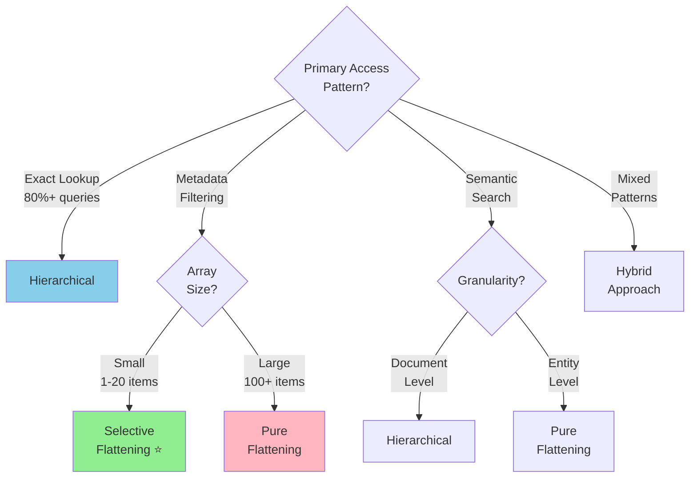
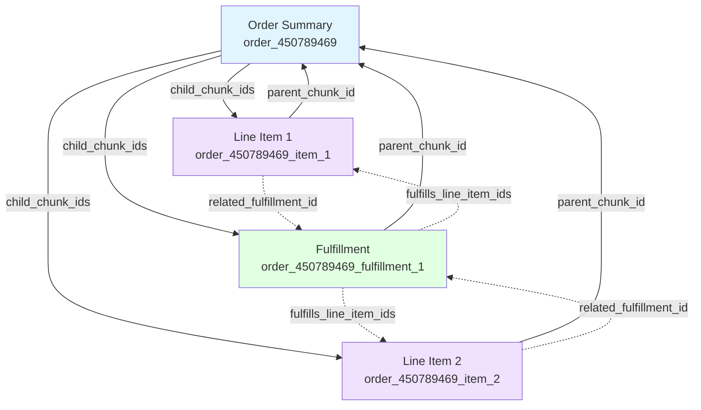

# Hierarchical JSON to Vector DB: Access Pattern-Driven Design

## Table of Contents

### Getting Started
- [Quick Start Decision Tree](#quick-start) - Start here for immediate guidance
- [Core Principle](#core-principle) - Why access patterns matter
- [Three Fundamental Architectures](#three-fundamental-architectures) - Overview of approaches

### Key Decisions
- [**Critical: Store Full Documents?**](#critical-decision-store-full-documents) - Most important cost decision
- [Decision Framework](#decision-framework) - Step-by-step architecture selection
  - [Step 1: Identify Access Patterns](#step-1-identify-your-access-patterns)
  - [Step 2: Map to Architecture](#step-2-map-patterns-to-architecture)
  - [Step 3: Choose](#step-3-choose-architecture)

### Implementation Examples
- [Practical Examples](#practical-examples)
  - [E-Commerce Orders (Shopify)](#example-1-e-commerce-orders) - Selective flattening
  - [Healthcare Records (FHIR)](#example-2-healthcare-records) - Hybrid approach

### Advanced Topics
- [Chunk Linking & Cross-References](#chunk-linking--cross-references) - For pure flattening/hybrid
  - [Navigation Patterns](#navigation-patterns)
  - [Reference Types](#reference-types)
  - [Best Practices](#best-practices)

### Reference
- [Configuration Schema](#configuration-schema) - Conceptual examples
- [Architecture Comparison Table](#architecture-comparison-table)
- [Quick Decision Checklist](#quick-decision-checklist)
- [Common Pitfalls](#common-pitfalls)
- [Vector Database Implementation](#vector-database-implementation) - Qdrant guide
- [Further Reading](#further-reading)

---

## Quick Start

**Start here if you want immediate guidance:**

```
Do you have a source database (MongoDB, Postgres, etc.)?
├─ YES → Use Selective Flattening + Reference Architecture ⭐
│         Storage: 0.2x (13 KB per order)
│         Cost: ~$50/month for 1M orders
│         Best for: 80% of use cases
│
└─ NO → Vector DB is your only storage
    ├─ Arrays < 20 items → Selective Flattening + Store Documents
    │                       Storage: 1.0x (63 KB per order)
    │                       Cost: ~$150/month for 1M orders
    │
    └─ Arrays > 50 items → Pure Flattening
                           Storage: 1.5-2.4x
                           Use when: Entity-level search is critical
```

**Quick decision:**
- **Most common**: Selective Flattening without documents (references only)
- **Simplest**: Hierarchical (if just doing lookups)
- **Most precise**: Pure Flattening (for large arrays with entity-level search)

---

## Core Principle

**There is no single "optimal" architecture for hierarchical JSON in vector databases. The right structure depends entirely on your access patterns.**

This document provides a decision framework to choose the optimal architecture based on how you'll query your data.

---

## Three Fundamental Architectures

### 1. Hierarchical (Keep Nested)
Store JSON as-is with minimal flattening.

```json
{
  "id": "order_12345",
  "vector": [...],
  "content": "Order summary...",
  "metadata": {
    "order_id": 12345  // ID only
  },
  "document": { /* full nested JSON */ }
}
```

**Storage overhead**: 1.0x (baseline)
**Best for**: Document retrieval, simple lookups

### 2. Selective Flattening (Extract Key Fields) ⭐
Keep nested structure, but promote important fields to metadata.

```json
{
  "id": "order_12345",
  "vector": [...],
  "metadata": {
    "order_id": 12345,
    "state": "CA",              // ← flattened from address.state
    "vendors": ["Apple"],        // ← extracted from line_items[*].vendor
    "total_price": 409.94
  },
  "content": "Order #12345 for Bob Norman: iPod shipped to CA...",
  // "document": { /* optional - see storage decision */ }
}
```

**Storage overhead**:
- With document: 1.0x
- Without document (reference only): **0.2x** (5x cheaper!)

**Best for**: Metadata filtering, aggregations (most common use case)

### 3. Pure Flattening (Separate Chunks)
Split into entity-level chunks with separate embeddings.

```json
// Chunk 1: Order
{"id": "order_12345", "vector": [...], "content": "Order summary..."}

// Chunk 2: Line item 1
{"id": "order_12345_item_1", "vector": [...], "content": "iPod Nano..."}

// Chunk 3: Line item 2
{"id": "order_12345_item_2", "vector": [...], "content": "Charger..."}
```

**Storage overhead**: 1.5-2.4x
**Best for**: Entity-level search, large arrays (>50 items)

---

## Critical Decision: Store Full Documents?

**This is the most important cost decision you'll make.**

### The Math

For 1M Shopify orders (typical e-commerce):

| Approach | Per Order | Total | Monthly Cost |
|----------|-----------|-------|--------------|
| **With full documents** | 63 KB | 63 GB | ~$150-200 |
| **Reference architecture** ⭐ | 13 KB | 13 GB | ~$40-60 |
| **Savings** | **5x smaller** | **50 GB saved** | **$100-140 saved** |

### Store Full Document IF:

✅ **Vector DB is your only data store**
- No MongoDB, Postgres, etc.
- Vector DB = source of truth

✅ **Source DB is slow**
- Fetching from source adds >100ms
- Network latency is high

✅ **Need offline access**
- Source DB might be unavailable
- Disaster recovery requirements

✅ **Need full JSON structure for API responses**
- Return complete Shopify order JSON to clients
- Don't want to reconstruct from metadata

### DON'T Store Full Document IF:

❌ **You have a source database** (most common)
- MongoDB, Postgres, S3, etc. as source of truth
- Use vector DB for search only
- Fetch full docs by ID from cheaper storage

❌ **Only use extracted fields**
- Analytics queries only need metadata
- LLM only needs the `content` summary
- Never access nested JSON

❌ **Cost sensitive**
- Full documents can be 5-10x larger than metadata
- Vector DB storage is expensive ($200/TB vs $10/TB for object storage)

❌ **Frequent updates**
- If orders update frequently, syncing full docs is overhead
- Easier to re-extract metadata from source on demand

### Reference Architecture (Recommended)

**Selective Flattening + External Source DB**

```json
// In Vector DB (Qdrant)
{
  "id": "order_12345",
  "vector": [...],
  "metadata": {
    "order_id": 12345,
    "vendors": ["Apple"],
    "total_price": 409.94,
    // Extract only what you filter/search on

    "source_db": "mongodb",
    "source_id": "64f1a2b3c4d5e6f7g8h9i0j1"  // ← Reference to full doc
  },
  "content": "Order #12345: iPod to Ontario..."  // For LLM
}

// In MongoDB (cheaper storage)
{
  "_id": "64f1a2b3c4d5e6f7g8h9i0j1",
  "order_id": 12345,
  /* full Shopify JSON - 50 KB */
}
```

**Query pattern**:
```python
# Step 1: Search/filter in vector DB (fast, 10-50ms)
results = qdrant.search(filter={"vendors": "Apple"})

# Step 2: If you need full docs, fetch from source (+10-30ms)
order_ids = [r.metadata["source_id"] for r in results]
full_docs = mongodb.find({"_id": {"$in": order_ids}})

# Most queries only need Step 1!
```

**Benefits**:
- Vector DB: 13 KB per order (only search data)
- MongoDB: 50 KB per order (cheaper storage: $10/TB vs $200/TB)
- **Total cost for 1M orders**: ~$50/month vs ~$200/month
- **5x storage savings**

---

## Decision Framework

### Step 1: Identify Your Access Patterns

| Pattern | Example Query | What You Need |
|---------|---------------|---------------|
| **Exact Lookup** | "Get order #12345" | Fast ID retrieval |
| **Metadata Filtering** | "Orders from CA over $500" | Indexed filter fields |
| **Document Semantic Search** | "Orders with shipping complaints" | Full-context embeddings |
| **Entity Semantic Search** | "Line items with 'birthday' engraving" | Per-entity embeddings |
| **Aggregation** | "Revenue by vendor" | Dimensional fields |
| **Relationship Traversal** | "All orders for customer X" | ID references |
| **Multi-Entity Joins** | "Failed fulfillments of Apple products" | Denormalized or chunked |

### Step 2: Map Patterns to Architecture



### Step 3: Choose Architecture

| If Your Top Access Pattern Is... | Use Architecture | Flatten What | Store Full Doc? |
|-----------------------------------|------------------|--------------|-----------------|
| Exact lookup (>50%) | **Hierarchical** | IDs only | ⚠️ See [storage decision](#store-full-documents) |
| Metadata filtering (>40%) | **Selective Flattening** ⭐ | Filter fields + arrays | ❌ Usually no (use refs) |
| Entity-level search (>30%) | **Pure Flattening** | Everything into chunks | ❌ Rarely (use refs) |
| Mixed (no dominant pattern) | **Hybrid** | Per entity type | Per-entity decision |

**Storage cost rule of thumb**:
- With full documents: 1.0-2.4x storage overhead
- Without full documents (references only): 0.2-0.3x (5x cheaper!)

---

## Practical Examples

### Example 1: E-Commerce Orders

**Access pattern distribution**:
- 35% - "Orders from state X"
- 25% - "Orders with product Y"
- 20% - "Get order by ID"
- 15% - "Revenue analytics"
- 5% - "Search order notes"

**Recommended**: Selective Flattening + Reference Architecture

```json
{
  "id": "order_12345",
  "vector": [...],
  "content": "Order #12345 for Bob Norman. iPod Nano to Ontario...",

  "metadata": {
    // Promote for filtering
    "order_id": 12345,
    "customer_id": 207119551,
    "shipping_state": "Ontario",
    "total_price": 409.94,
    "created_at": "2024-03-10",

    // Extract from arrays
    "vendors": ["Apple"],
    "product_ids": [7513594],
    "skus": ["IPOD-342-N"],

    // Reference to full document
    "source_db": "postgres",
    "source_id": 12345
  }
  // No "document" field - saves 50 KB per order!
}
```

**Query examples**:
```python
# Metadata filtering (10-50ms)
orders = vector_db.search(
    filter={"shipping_state": "Ontario", "vendors": {"$contains": "Apple"}}
)

# If need full docs, fetch from source (+10-30ms)
full_orders = postgres.query("SELECT * FROM orders WHERE id = ANY($1)",
                              [o.metadata["source_id"] for o in orders])

# Aggregation (metadata only, no source fetch needed)
revenue_by_state = aggregate(
    vector_db.search(filter={"created_at": {"$gte": "2024-01-01"}}),
    group_by="shipping_state",
    sum="total_price"
)
```

**Why this works**:
- Line items are small (1-10 per order typically)
- Don't need to rank individual items
- Metadata has everything for filtering/aggregation
- Fetch full doc only when actually needed (rare)

**Storage savings**:
- With documents: 63 KB × 1M = 63 GB
- Reference only: 13 KB × 1M = 13 GB
- **Savings: 50 GB (5x cheaper)**

---

### Example 2: Healthcare Records

**Access pattern distribution**:
- 40% - "Patients with lab X > Y"
- 25% - "Get patient record"
- 20% - "Find similar patient cases"
- 15% - "Lab trends over time"

**Recommended**: Hybrid (Hierarchical patients + Flattened observations)

**Patient document** (Hierarchical with documents):
```json
{
  "id": "patient_67890",
  "resource_type": "Patient",
  "vector": [...],
  "content": "Patient John Smith, age 59, male...",
  "metadata": {
    "patient_id": "patient-67890",
    "mrn": "MRN-123456",
    "age": 59,
    "gender": "male"
  },
  "document": { /* FHIR Patient resource - keep full doc (only 100K patients) */ }
}
```

**Observation chunks** (Pure Flattening without documents):
```json
{
  "id": "obs_glucose_001",
  "resource_type": "Observation",
  "vector": [...],
  "content": "Glucose 145 mg/dL (High) for patient MRN-123456 on 2024-03-10",
  "metadata": {
    "patient_id": "patient-67890",
    "observation_code": "2339-0",  // LOINC code
    "value": 145,
    "unit": "mg/dL",
    "interpretation": "H",
    "date": "2024-03-10"
  }
  // No "document" field - saves space on 20M observations!
}
```

**Query examples**:
```python
# Lab value filtering (precise, 10-30ms)
high_glucose = vector_db.search(
    filter={
        "resource_type": "Observation",
        "observation_code": "2339-0",
        "value": {"$gte": 126}
    }
)

# Patient record retrieval (5-15ms)
patient = vector_db.get(id="patient_67890")

# Similar cases (semantic, 80-200ms)
similar = vector_db.search(
    query_embedding=embed("chest pain elevated BP high glucose"),
    filter={"resource_type": "Observation"}
)
```

**Why hybrid?**:
- Patients: Few (100K), need full FHIR resource, keep documents
- Observations: Many (20M), only need metadata for filtering, use references
- Different optimal strategies for different resource types

**Storage breakdown**:
- Patients (with docs): 100K × 64 KB = 6.4 GB
- Observations (no docs): 20M × 10 KB = 200 GB
- **Total: 206 GB** (vs 400 GB if storing full observation documents)

---

## Chunk Linking & Cross-References

**Only needed for Pure Flattening or Hybrid approaches.**

When splitting documents into separate chunks, maintain relationships to enable:
- Navigation (parent → children, child → parent)
- Reassembly (reconstruct full documents)
- Traversal (follow relationships between entities)

### Linking Strategy

**Bidirectional references** in metadata:



```json
// Parent chunk (Order)
{
  "id": "order_12345",
  "metadata": {
    "order_id": 12345,
    "chunk_type": "order_summary",

    // Links to children
    "child_chunk_ids": [
      "order_12345_item_1",
      "order_12345_item_2",
      "order_12345_fulfillment_1"
    ]
  }
}

// Child chunk (Line Item)
{
  "id": "order_12345_item_1",
  "metadata": {
    "line_item_id": 669751112,
    "chunk_type": "line_item",

    // Link to parent
    "parent_chunk_id": "order_12345",
    "order_id": 12345,  // Also store root ID for filtering

    // Links to related chunks
    "related_fulfillment_id": "order_12345_fulfillment_1"
  }
}

// Related chunk (Fulfillment)
{
  "id": "order_12345_fulfillment_1",
  "metadata": {
    "fulfillment_id": 255858046,
    "chunk_type": "fulfillment",

    "parent_chunk_id": "order_12345",
    "order_id": 12345,

    // Back-reference to what it fulfilled
    "fulfills_line_item_ids": ["order_12345_item_1", "order_12345_item_2"]
  }
}
```

### Navigation Patterns

**1. Drill-Down (Parent → Children)**
```python
# Find order, get all details
order = vector_db.get(id="order_12345")
child_ids = order.metadata["child_chunk_ids"]
children = vector_db.batch_get(ids=child_ids)

# Organize by type
line_items = [c for c in children if c.metadata["chunk_type"] == "line_item"]
fulfillments = [c for c in children if c.metadata["chunk_type"] == "fulfillment"]
```

**2. Roll-Up (Child → Parent)**
```python
# Found relevant line item, get full order context
line_item = vector_db.search(filter={"sku": "IPOD-342-N"})[0]
parent_id = line_item.metadata["parent_chunk_id"]
order = vector_db.get(id=parent_id)
```

**3. Sibling Traversal**
```python
# From line item, find its fulfillment
line_item = vector_db.get(id="order_12345_item_1")
fulfillment_id = line_item.metadata["related_fulfillment_id"]
fulfillment = vector_db.get(id=fulfillment_id)
```

**4. Fetch All Related (Root ID)**
```python
# Get everything for an order
all_chunks = vector_db.search(filter={"order_id": 12345})
# Returns all chunks regardless of type
```

### Reference Types

| Reference Type | Direction | Use Case | Example |
|----------------|-----------|----------|---------|
| `parent_chunk_id` | Child → Parent | Get full context | Line item → Order |
| `child_chunk_ids` | Parent → Children | Drill down | Order → All items |
| `related_*_id` | Sibling → Sibling | Cross-entity links | Item → Fulfillment |
| `root_id` | Any → Root | Fetch all related | Any chunk → Order ID |

### Best Practices

1. **Always include root ID**: Every chunk should have the root document ID for easy filtering
2. **Denormalize common lookups**: Store frequently accessed references directly (e.g., customer_id in line items)
3. **Use consistent naming**: `{entity_type}_id` pattern (order_id, customer_id, product_id)
4. **Batch fetches**: Use `batch_get()` to retrieve multiple chunks efficiently
5. **Index reference fields**: Ensure parent_id, root_id are indexed for fast joins

### When Cross-References Matter

| Architecture | Need Cross-References? | Why |
|--------------|------------------------|-----|
| **Hierarchical** | ❌ No | Everything is in one document |
| **Selective Flattening** | ❌ Usually No | Document is still intact, metadata is just enriched |
| **Pure Flattening** | ✅ **Critical** | Chunks must link to reassemble context |
| **Hybrid** | ✅ Yes | Different resource types need to reference each other |

**Rule of thumb**: If you split entities into separate vector embeddings, you MUST implement cross-references.

---

## Configuration Schema

**Note**: This is a conceptual example showing how you might structure transformation decisions. This is NOT executable code.

Define architecture per entity type based on access patterns:

```yaml
entities:
  order:
    # Define based on your access patterns
    primary_access_patterns:
      - type: metadata_filter
        frequency: 0.35
      - type: entity_search
        frequency: 0.25
      - type: exact_lookup
        frequency: 0.20

    # Considering the access patterns above
    architecture: selective_flattening
    store_full_document: false  # Use reference architecture

    flatten_to_metadata:
      - order_id
      - customer_id
      - shipping_state
      - total_price
      - created_at

    extract_from_arrays:
      - source: "line_items[*].vendor"
        target: "vendors"
      - source: "line_items[*].sku"
        target: "skus"

    source_reference:
      enabled: true
      db: "postgres"
      table: "orders"
      id_field: "id"

  observation:
    primary_access_patterns:
      - type: entity_search
        frequency: 0.40
      - type: metadata_filter
        frequency: 0.40

    # Auto-selects: pure_flattening
    architecture: pure_flattening
    store_full_document: false
    chunk_boundary: per_observation

    flatten_to_metadata:
      - observation_code
      - value
      - unit
      - date
```

---

## Architecture Comparison Table

| Criteria | Hierarchical | Selective Flattening | Pure Flattening |
|----------|--------------|---------------------|-----------------|
| **Storage (with docs)** | 1.0x | 1.0x | 1.5-2.4x |
| **Storage (refs only)** | 1.0x | **0.2x** ⭐ | 0.3-0.5x |
| **Queries** | Simple lookups | Metadata filters + semantic | Complex entity-level |
| **Precision** | Document-level | Document-level | Entity-level |
| **Complexity** | Low | Medium | High |
| **Need Source DB?** | Optional | **Recommended** | **Recommended** |
| **Best For** | <ul><li>Get by ID</li><li>Simple search</li></ul> | <ul><li>Filtering</li><li>Aggregations</li><li>Small arrays</li></ul> | <ul><li>Large arrays</li><li>Entity ranking</li><li>Joins</li></ul> |

**Key insight**: If you have a source database, don't store full documents in vector DB. Extract only what you search/filter on. **Saves 5x storage costs.**

---

## Quick Decision Checklist

**Use Hierarchical if**:
- [ ] "Get by ID" is >50% of queries
- [ ] JSON is shallow (1-2 levels)
- [ ] Simplicity is preferred

**Use Selective Flattening if** ⭐ (Most Common):
- [ ] Need metadata filtering
- [ ] Arrays are small (<20 items)
- [ ] Want to avoid chunk assembly
- [ ] Mixed access patterns
- [ ] **Have source DB? Don't store full documents (5x savings)**

**Use Pure Flattening if**:
- [ ] Arrays are large (>50 items)
- [ ] Need to rank entities independently
- [ ] Entity-level precision is critical
- [ ] Complex multi-entity joins

**Use Hybrid if**:
- [ ] Different entity types have different needs
- [ ] No single dominant access pattern
- [ ] Willing to manage complexity for performance
- [ ] Example: Patients (hierarchical) + Observations (flattened)

---

## Common Pitfalls

❌ **Don't**: Flatten everything by default
✅ **Do**: Start hierarchical, flatten only what you filter/search on

❌ **Don't**: Store full documents when you have a source DB
✅ **Do**: Use reference architecture (5x cheaper)

❌ **Don't**: Create chunks for small arrays (<10 items)
✅ **Do**: Extract array values into metadata arrays

❌ **Don't**: Use same architecture for all entity types
✅ **Do**: Analyze per entity type and use hybrid approaches

❌ **Don't**: Over-optimize prematurely
✅ **Do**: Start simple, evolve based on actual query patterns

---

## Vector Database Implementation

This framework is designed for **Qdrant**, though the principles apply to other vector databases.

**See**: [`qdrant-implementation.md`](./qdrant-implementation.md) for:
- Why Qdrant for hierarchical JSON
- Comparison with Pinecone, Weaviate, pgvector, Milvus
- Complete collection setup code
- Query patterns and optimizations
- Performance benchmarks

**Key Qdrant advantages for this use case**:
- Native nested payload filtering (critical for metadata-first queries)
- Array field indexing (for extracted vendors, SKUs, etc.)
- Built-in quantization (4x memory savings)
- Self-hosting option (compliance requirements)
- Sparse vector support (hybrid search)

---

## Further Reading

### Implementation Examples
- **Shopify Orders**: See `shopify-implementation-example.md` - Complete e-commerce example with selective flattening
- **Healthcare FHIR**: See `fhir-healthcare-implementation.md` - Clinical data with hybrid approach

### Technical Deep-Dives
- **Qdrant Implementation**: See `qdrant-implementation.md` - Collection setup, queries, benchmarks
- **Vector DB Comparison**: Architecture choices depend on vector DB capabilities

### Related Topics
- Embedding model selection (OpenAI, Cohere, open-source)
- RAG (Retrieval-Augmented Generation) patterns
- Production monitoring and observability

---

## Summary

1. **Analyze your access patterns first** - don't assume an architecture
2. **Most use cases benefit from selective flattening + reference architecture** - 5x storage savings
3. **Use pure flattening only when necessary** - for large arrays or entity-level precision
4. **Hybrid approaches are valid** - different entities can use different strategies
5. **Don't store full documents if you have a source DB** - biggest cost optimization

**The optimal architecture is the one that matches your query patterns, not a universal "best practice."**

**Recommended starting point for 80% of use cases**: Selective Flattening + Reference Architecture
- Storage: 0.2x (13 KB per order)
- Cost: ~$50/month for 1M orders
- Performance: 10-50ms queries
- Complexity: Medium
